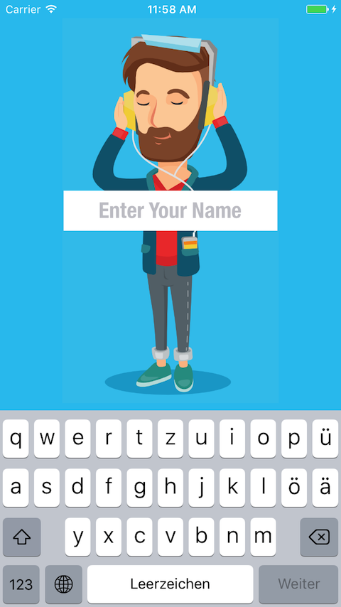

# SILLY-SONG
## udacity.com student submission

*This repository contains the project submission for udacity.com project work "SillySong" during my iOS developer certification program (course ND003).*

## App Description

The app „Silly Song“ will prompt the user for their name, then build the lyrics to a silly song that incorporates their name.

## App Specifications

SillySong master (currently 1.0.2) using the latest XCode 8.3 (8E162) version and will be able to run under iOS version 9.n up to the latest iOS version 10.n. SillySong uses 3rd Party Libraries for better UX/UI behavior and graphical elements from vectorstock. A complete list of used libraries can be found inside the projects [COPYRIGHT.md](COPYRIGHT.md) file.

## App Features

SillySong using an advanced keyboard handling to prevent keyboard-view overlay during input in landscape mode.

*The next version (1.0.3) will be able to read your lyrics aloud using the iOS internal AVFoundation library *

## App Structure

SillySong is following the MVC pattern by structural and logical definition. The app is using dedicated view partials instead of base sub views of table cells and annotations.

 

### SplashScreen / Initial View

Splash Screen             |  Welcome Screen
:-------------------------:|:-------------------------:
  |  

### EditView

Create Lyric Screen             |  Result Screen
:-------------------------:|:-------------------------:
  |  

## Keywords
swift, swift-3, udacity, extension, uikit, foundation, app

## Releases

SillySong is currently available in [3 releases](https://github.com/paterik/udacity-ios-silly-song/releases) and will be following the Sequence-based version pattern _major.minor[.maintenance[.build]]_. The Build will be auto-generated during each XCode-Build-Prozess using 3rd-Party-Script [xcode-version-bump.sh](https://gist.github.com/sekati/3172554) of Jason Horwitz (sekati). The build number won’t be part of my semantic versioning. 

## Changelog

All notable changes of the SillySong release series are documented in project [CHANGELOG.md](CHANGELOG.md) file using the [Keep a CHANGELOG](http://keepachangelog.com/) principles. The changelog documentation starts with version 1.0.0 (2017-04-06). The latest „reviewed“ version of SillySong met the specifications to accomplish the course sub goal. 

## License-Term

Copyright (c) 2017 Patrick Paechnatz <patrick.paechnatz@gmail.com>
                                                                           
Permission is hereby granted,  free of charge,  to any  person obtaining a copy of this software and associated documentation files (the "Software"), to deal in the Software without restriction,  including without limitation the rights to use,  copy, modify, merge, publish,  distribute, sublicense, and/or sell copies  of the  Software,  and to permit  persons to whom  the Software is furnished to do so, subject to the following conditions:       
                                                                           
The above copyright notice and this permission notice shall be included in all copies or substantial portions of the Software.
                                                                           
THE SOFTWARE IS PROVIDED "AS IS", WITHOUT WARRANTY OF ANY KIND, EXPRESS OR IMPLIED, INCLUDING  BUT NOT  LIMITED TO THE WARRANTIES OF MERCHANTABILITY, FITNESS FOR A PARTICULAR  PURPOSE AND  NONINFRINGEMENT.  IN NO EVENT SHALL THE AUTHORS OR COPYRIGHT HOLDERS BE LIABLE FOR ANY CLAIM, DAMAGES OR OTHER LIABILITY,  WHETHER IN AN ACTION OF CONTRACT,  TORT OR OTHERWISE,  ARISING FROM,  OUT OF  OR IN CONNECTION  WITH THE  SOFTWARE  OR THE  USE OR  OTHER DEALINGS IN THE SOFTWARE.